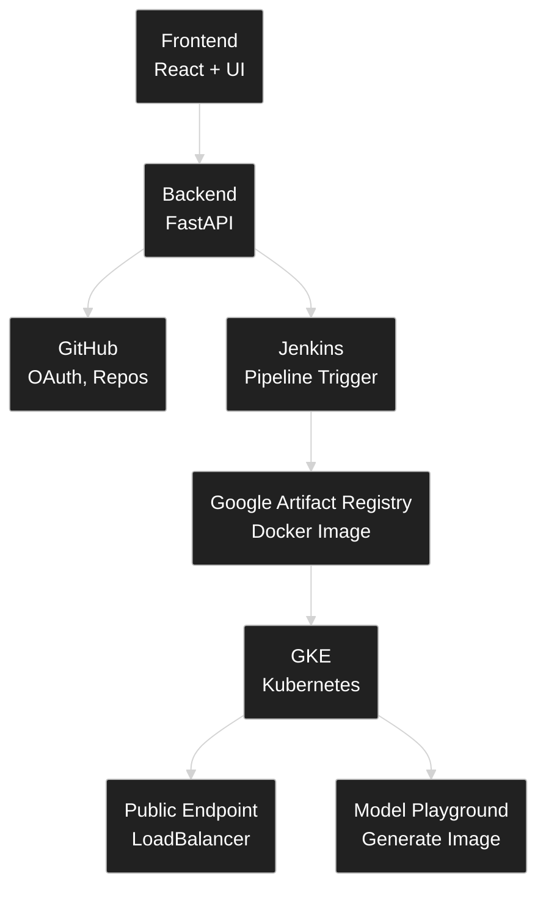
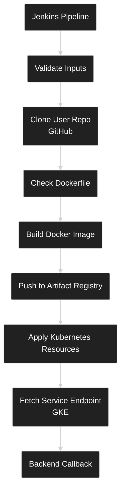
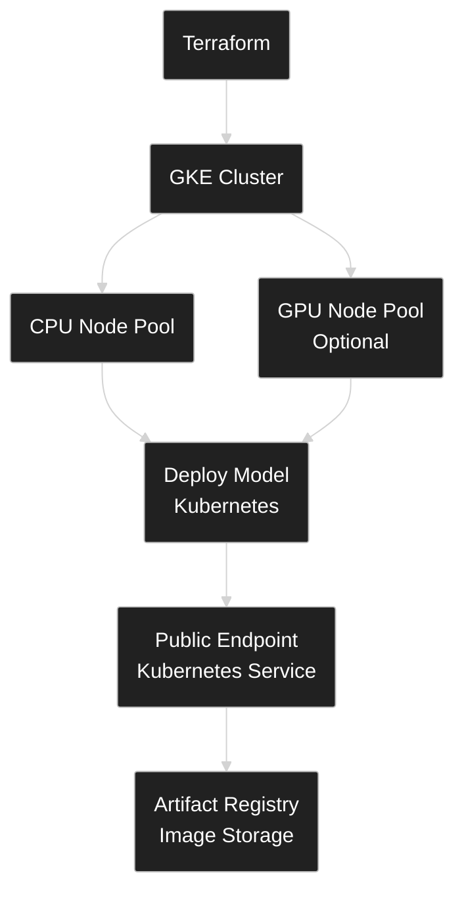

# Diffusion MLOps Platform (GitHub → Build → Deploy → Endpoint → Playground)

A self-serve deployment platform for developers building **image diffusion models**.

Log in with GitHub, select a repo + branch, click deploy, and the platform:
1) builds your Docker image from **your** model repo
2) pushes it to **Google Artifact Registry**
3) deploys it to **GKE (Kubernetes)**
4) returns a public **endpoint** to test
5) provides a **Model Playground** UI to generate images from prompts

---

## What problem this solves

Deploying diffusion models is not just “run a container”:
- repos have heavy dependencies and custom runtimes
- you need a consistent path from GitHub code → container → endpoint
- you need a UI layer to manage model versions and test quickly
- GPU is expensive, so you want a clear path to use GPU only when needed (and cheaper GPU via spot)

This platform packages that entire flow into one dashboard.

---

## Tech stack

**Backend**
- FastAPI
- PostgreSQL, SQLAlchemy + Alembic migrations
- GitHub OAuth (login)
- JWT auth stored in HTTP-only cookie
- Jenkins integration (trigger builds + receive callback)

**Frontend**
- React (Vite)
- Tailwind UI + shadcn-like components
- Pages: Login, Projects, Project Detail, Deployments, Gallery
- Playground modal for prompt-based generation

**Infra + CI/CD**
- Terraform for GKE and node pools
- Jenkins declarative pipeline for build/push/deploy
- Docker for build artifacts
- Google Artifact Registry (image storage)
- Kubernetes (Deployment + Service LoadBalancer)

---

## Repository structure

### Backend (`/backend`)
- `alembic/` – database migrations
- `app/routes/`
  - `auth.py` – GitHub OAuth + JWT cookie
  - `github.py` – list repos/branches using stored GitHub token
  - `projects.py` – CRUD projects
  - `deployments.py` – create deployment + trigger Jenkins + Jenkins callback
  - `images.py` – generate image via deployed endpoint + gallery APIs
- `app/models/` – SQLAlchemy models (User, Project, Deployment, AuditLog, Image)
- `app/utils/security.py` – token encryption/decryption + auth helpers

### Frontend (`/frontend`)
- `src/pages/`
  - `Login.jsx` – GitHub login redirect
  - `Projects.jsx` – list projects + create new
  - `ProjectDetailPage.jsx` – deploy + deployment history (polling)
  - `Deployments.jsx` – global deployment view + filters/stats
  - `GalleryPage.jsx` – generated images gallery
- `src/components/`
  - `NewProjectModal.jsx` – repo/branch picker
  - `ImageGenerationModal.jsx` – Model Playground
  - `Sidebar.jsx`, `ProtectedRoute.jsx`, `Layout.jsx`

### Infra (`/infra`)
- `main.tf` – GKE cluster + CPU node pool (+ GPU pool optional)
- `variables.tf` / `terraform.tfvars` – environment configuration
- `output.tf` – cluster outputs

### CI/CD
- `Jenkinsfile` – builds user repo, pushes image, applies Kubernetes, calls backend callback

### Kubernetes templates (`/k8s`)
- `deployment.yaml` – model deployment template (health probes + resources)
- `service.yaml` – LoadBalancer for public endpoint

---

## Architecture Overview

This platform connects GitHub auth + repo selection to an automated build/deploy pipeline and a testing UI.

---

### Platform Diagram

The **Platform Diagram** below illustrates how different components interact in the system:



---

### Pipeline Diagram

The **Pipeline Diagram** below shows the steps in the Jenkins pipeline that builds, pushes, and deploys the model.



---

### Infrastructure Diagram

The **Infrastructure Diagram** below outlines the infrastructure setup including Terraform, GKE, and Kubernetes.



---

### Key design choices
- **Backend owns the workflow**: frontend never talks to Jenkins or GitHub directly.
- **Deployment ID is the source of truth**: used for image tags, k8s names, and DB records.
- **Callback updates DB**: frontend polls the backend for status, not Jenkins.

## End-to-end workflow

### 1) GitHub login (OAuth)
Backend routes:
- `GET /auth/github/login`
  - Redirects to GitHub OAuth with scope `read:user user:email repo`
- `GET /auth/github/callback?code=...`
  - Exchanges code → access token
  - Fetches GitHub profile (+ email fallback)
  - Upserts user in DB
  - Stores encrypted GitHub token in DB
  - Creates audit log record
  - Issues JWT (7 days) in an HTTP-only cookie

Why cookie-based JWT:
- avoids localStorage tokens
- simplifies frontend axios usage

### 2) Repo + branch selection
Frontend `NewProjectModal` calls:
- `GET /github/repos`
- `GET /github/repos/{owner}/{repo}/branches`
Then:
- `POST /projects/`

Why “Project”:
- Project = repo + branch configuration
- Deployment = a versioned build and rollout event

### 3) Trigger deployment
Frontend calls:
- `POST /deployments/start/{project_id}`

Backend logic:
1) validates project ownership  
2) creates `Deployment` record with status `building`  
3) decrypts GitHub token  
4) triggers Jenkins with:
   - `REPO_URL`, `BRANCH_NAME`, `DEPLOYMENT_ID`, `GITHUB_TOKEN`

If Jenkins is unreachable:
- status → `failed`
- `build_log` stores the error (so UI shows a reason)

### 4) Jenkins pipeline (what it does)

Stages:
1) Validate inputs  
2) Clone repo using user token + checkout branch  
3) Ensure Dockerfile exists  
4) Docker build  
5) Auth to GCP + push to GAR with tag = `DEPLOYMENT_ID`  
6) Render + apply k8s deployment/service  
7) Wait rollout + fetch LoadBalancer endpoint  

### 5) Jenkins → Backend callback
After build, Jenkins calls:
- `POST /deployments/jenkins/callback`

Backend updates:
- deployment status: `succeeded` or `failed`
- endpoint URL (LoadBalancer)
- build log message + build number
- project last_deployed_at

Frontend sees this through polling.

## Model runtime contract (required endpoints)

Your deployed model container must expose:

### `GET /health`
Used by:
- readiness/liveness probes
- backend health checks

Must return **200** when ready.

### `POST /generate`
Used by the platform to generate images from the Playground.

Example payload:
```json
{
  "prompt": "Cat in a sofa",
  "steps": 50,
  "guidance_scale": 7.5,
  "width": 256,
  "height": 256
}
```
---

## GPU plan (GKE + NVIDIA T4 + Spot)

Terraform currently provisions:
- a standard GKE cluster
- a CPU node pool (e2-standard-2) for baseline workloads
- n1-standard-4
- nvidia-tesla-t4
- spot = true

### Why spot:
- GPU cost is high, spot reduces cost a lot for demos/prototypes
- tradeoff: nodes can be reclaimed any time

### To enable GPU scheduling for model deployments:
1. enable GPU node pool in Terraform
2. install/enable NVIDIA drivers/device plugin in the cluster
3. update k8s deployment template:
   - add nodeSelector for gpu-pool
   - request/limit nvidia.com/gpu: "1"

---

## Environment variables

### Backend
- GITHUB_CLIENT_ID
- GITHUB_CLIENT_SECRET
- JWT_SECRET
- JWT_ALGORITHM
- FRONTEND_URL
- BACKEND_URL
- JENKINS_URL
- JENKINS_USER
- JENKINS_API_TOKEN
- JOB_NAME
- JOB_TOKEN

### Jenkins (pipeline env)
- GCP_PROJECT
- GKE_CLUSTER
- GKE_LOCATION
- GAR_HOST
- GAR_REPO
- PIPELINE_REPO_URL
- BACKEND_URL

### Frontend
- VITE_API_BASE_URL

---

## Troubleshooting

### Deployment stuck in building
- check Jenkins job logs
- check Kubernetes rollout:
```bash
  kubectl rollout status deploy/<deploy-name> --timeout=900s
  kubectl get pods
  kubectl logs -f deploy/<deploy-name>
```

## Troubleshooting

### Health probe failures
- ensure model container implements GET /health
- increase initialDelaySeconds if model loads slowly

### Generate fails from Playground
- verify endpoint is healthy: `{endpoint}/health`
- verify POST /generate returns image bytes
- check backend logs for timeout (backend uses a long timeout)

---

[Click here to see demo](https://drive.google.com/file/d/16fv8KVn6AWRLlf8h1kVRs940W3_dK9rs/view?usp=drive_link)

